# SharePoint Semiconductor Knowledge Search

This proof of concept turns source-grounded semiconductor data from Azure
Databricks into a rich Microsoft 365 document corpus and indexes it directly
from SharePoint Online with Azure AI Search. The resulting chunk index is
designed for hybrid retrieval and a later Microsoft Foundry agent that merges
document knowledge with live Databricks MCP answers.

The solution does **not** copy or stage SharePoint files in Azure Blob Storage.
SharePoint Online remains the document system of record.

## Table of contents

1. [Solution status](#solution-status)
2. [Deployed URLs](#deployed-urls)
3. [Architecture](#architecture)
4. [Data and corpus](#data-and-corpus)
5. [Repository layout](#repository-layout)
6. [Prerequisites](#prerequisites)
7. [Deploy the solution](#deploy-the-solution)
8. [Azure AI Search design](#azure-ai-search-design)
9. [Security model](#security-model)
10. [Operations and validation](#operations-and-validation)
11. [Relevance evaluation and feedback](#relevance-evaluation-and-feedback)
12. [Foundry agent integration](#foundry-agent-integration)
13. [Preview limitations](#preview-limitations)
14. [Cost and production scaling](#cost-and-production-scaling)
15. [Best-practice references](#best-practice-references)
16. [License](#license)

## Solution status

| Component | Configuration | Status |
| --- | --- | --- |
| Databricks source | Six tables in `caldova_dbx_westus2.arrow_semiconductor` | Profiled through the existing private MCP agent |
| Office corpus | 34 DOCX, 33 PPTX, 33 XLSX | 100/100 structurally validated |
| Azure AI Search | Basic, West US, 1 partition, 1 replica, system identity | Deployed |
| Embeddings | `text-embedding-3-small`, 1,536 dimensions | Existing deployment authorized for Search |
| SharePoint site and library | Private Microsoft 365 group site, 100 files | Deployed and validated |
| Direct SharePoint indexer | `2026-08-01-preview`, hourly | 100 files processed, 0 failed, 289 chunks indexed |
| Ranking evaluation | 12 hybrid semantic/vector queries | Source-table routing@1 100%, routing MRR 1.0 |
| Feedback loop | `semiconductor-search-feedback` index | Deployed and write-tested |

SharePoint Online is a Microsoft 365 service, so the site itself is not an
Azure resource inside `m365-myaacoub`. Azure AI Search, Databricks, Foundry,
and related Azure resources are in that resource group.

## Deployed URLs

| Resource | URL |
| --- | --- |
| SharePoint site | [Semiconductor Knowledge Hub](https://caldova37587778.sharepoint.com/sites/semiconductorknowledgehub) |
| SharePoint library | [Semiconductor Knowledge](https://caldova37587778.sharepoint.com/sites/semiconductorknowledgehub/Semiconductor%20Knowledge/Forms/AllItems.aspx) |
| Azure AI Search portal | [semiconductor-search-myaacoub](https://portal.azure.com/#@caldova37587778.onmicrosoft.com/resource/subscriptions/cf824570-a8ba-497a-a184-0a52f1830aa9/resourceGroups/m365-myaacoub/providers/Microsoft.Search/searchServices/semiconductor-search-myaacoub/overview) |
| Search endpoint | [semiconductor-search-myaacoub.search.windows.net](https://semiconductor-search-myaacoub.search.windows.net) |
| Search Explorer | [Open Search Explorer](https://portal.azure.com/#@caldova37587778.onmicrosoft.com/resource/subscriptions/cf824570-a8ba-497a-a184-0a52f1830aa9/resourceGroups/m365-myaacoub/providers/Microsoft.Search/searchServices/semiconductor-search-myaacoub/searchExplorer) |
| Databricks workspace | [caldova-dbx-westus2](https://portal.azure.com/#@caldova37587778.onmicrosoft.com/resource/subscriptions/cf824570-a8ba-497a-a184-0a52f1830aa9/resourceGroups/m365-myaacoub/providers/Microsoft.Databricks/workspaces/caldova-dbx-westus2/overview) |
| Foundry resource | [foundry-myaacoub-private](https://portal.azure.com/#@caldova37587778.onmicrosoft.com/resource/subscriptions/cf824570-a8ba-497a-a184-0a52f1830aa9/resourceGroups/m365-myaacoub/providers/Microsoft.CognitiveServices/accounts/foundry-myaacoub-private/overview) |

The deployment scripts write confirmed, non-secret resource identifiers and
URLs under `.state/`. That folder is intentionally ignored by Git.
Applications should query the stable `semiconductor-knowledge` index alias,
not a timestamped physical index name.

## Architecture

```mermaid
flowchart LR
    DBX[Azure Databricks<br/>arrow_semiconductor tables]
    MCP[Private Databricks MCP<br/>through APIM]
    AGENT[Existing Foundry agent<br/>semiconductor-sales]
    GEN[Corpus generator]
    SP[SharePoint Online<br/>Semiconductor Knowledge]
    IDX[SharePoint indexer<br/>2026-08-01-preview]
    SPLIT[Text Split skill<br/>512 tokens + 128 overlap]
    EMB[text-embedding-3-small<br/>1536 dimensions]
    SEARCH[Chunk index<br/>semantic + vector + keyword]
    FUTURE[Future Foundry agent]

    DBX --> MCP --> AGENT --> GEN --> SP
    SP --> IDX --> SPLIT --> EMB --> SEARCH
    SEARCH --> FUTURE
    MCP -. live structured facts .-> FUTURE
```



There is no Blob Storage hop between SharePoint and Azure AI Search. The
indexer's data source has type `sharepoint` and its `includeLibrary` query is
scoped to the dedicated document library.

## Data and corpus

The source profile contains six fully qualified Databricks tables:

- `caldova_dbx_westus2.arrow_semiconductor.defect_analysis`
- `caldova_dbx_westus2.arrow_semiconductor.fab_production`
- `caldova_dbx_westus2.arrow_semiconductor.inventory`
- `caldova_dbx_westus2.arrow_semiconductor.product_sales`
- `caldova_dbx_westus2.arrow_semiconductor.supply_chain`
- `caldova_dbx_westus2.arrow_semiconductor.wafer_yield`

The profile was obtained through the existing `semiconductor-sales` Foundry
agent and private Databricks MCP connection. It includes aggregate metrics,
schema definitions, source SQL, quality notes, and a bounded representative
sample. No direct personal-identifier columns were present.

The generated corpus is balanced across Quality, Manufacturing, Inventory,
Sales, Supply Chain, and Yield. Every artifact includes:

- A stable `SEM-###` artifact ID.
- The fully qualified Databricks source table.
- The profile timestamp and source system.
- Narrative text, source-grounded values, and tabular data.
- Full-table row counts, date coverage, data-quality facts, measure ranges, and
  bounded representative-sample observations.
- Clearly labeled recommended follow-up actions, kept separate from source facts.
- Charts, lineage diagrams, tables, bullets, and typed source schemas.
- At least four Word pages with five tables and two visuals, eight PowerPoint
  slides (with schema pagination when needed), or seven named Excel worksheets
  with a chart and conditional formatting.

SharePoint metadata columns are `ArtifactId`, `KnowledgeCategory`,
`SourceTable`, `SourceSystem`, and `ProfileGeneratedAt`. The Search data source
requests these columns with `additionalColumns`, and each projected chunk
inherits them.

## Repository layout

```text
.
|-- README.md
|-- LICENSE
|-- requirements.txt
|-- config/
|   `-- search-evaluation.cases
|-- docs/
|   `-- deployment-evidence.md
|-- data/
|   `-- semiconductor_profile.json       # generated, ignored
|-- corpus/
|   |-- manifest.json                    # generated, ignored
|   `-- <category>/*.docx|*.pptx|*.xlsx  # generated, ignored
`-- scripts/
    |-- deploy_staged.ps1
    |-- evaluate_search.ps1
    |-- fetch_semiconductor_profile.py
    |-- generate_corpus.py
    |-- promote_search_index.ps1
    |-- provision_search.ps1
    |-- provision_sharepoint.ps1
    |-- submit_search_feedback.ps1
    |-- validate_corpus.py
    `-- validate_search.ps1
```

## Prerequisites

- Windows PowerShell 7 and Azure CLI.
- Python 3.13 or a compatible supported Python 3 release.
- Azure access to subscription `cf824570-a8ba-497a-a184-0a52f1830aa9`.
- An active Azure PowerShell context for that subscription (`Get-AzContext`).
- Microsoft 365 administrator access in tenant
  `12a4b86b-e64c-43f9-af05-d9130a72dfd2`.
- Permission to create Microsoft 365 groups, SharePoint lists, Entra
  applications, app-role grants, role assignments, and Search resources.
- Registration for the [SharePoint indexer preview](https://aka.ms/azure-cognitive-search/indexer-preview).

The deployment uses the signed-in Azure PowerShell administrator to bootstrap
a temporary Graph provisioner. That app's short-lived password exists only in
process memory and the app is deleted in a `finally` block after upload. The
standing Search ingestion app has no passwords or certificates and uses a
managed-identity federated credential. No password, client secret, Search key,
or token is stored in the repository or `.state/` files.

## Deploy the solution

### 1. Create a Python environment

```powershell
python -m venv .venv
.\.venv\Scripts\python.exe -m pip install -r requirements.txt
```

### 2. Fetch a current Databricks profile

```powershell
.\.venv\Scripts\python.exe scripts\fetch_semiconductor_profile.py
```

This invokes the existing Foundry prompt agent. It issues bounded, read-only
queries through the private Databricks MCP server and validates the returned
JSON shape before writing the profile.

### 3. Run the recommended staged deployment

```powershell
.\scripts\deploy_staged.ps1
```

This is the default end-to-end workflow. It executes the requested order:

1. Provision or reuse the SharePoint site, library, folders, and metadata.
2. Generate six fast bootstrap files: two DOCX, two PPTX, and two XLSX, with
  one artifact from each semiconductor domain.
3. Upload those files to a dedicated bootstrap library, create isolated
   bootstrap Search resources, validate them, and run the routing suite.
4. Generate and structurally validate the full 100-file replacement corpus
   before changing the production library.
5. Upload the full set, build a versioned candidate index without touching the
   current index, validate coverage and routing, then atomically promote it
   through the stable `semiconductor-knowledge` Search alias.

The previous physical index is retained for rollback. The standing feedback
index is preserved across document generations. Before production files are
replaced, the currently served generation's indexer is disabled. After alias
promotion, only the promoted indexer's schedule remains enabled; rollback
indexes therefore remain immutable snapshots.
Use `-RefreshProfile` to query Databricks through the existing Foundry agent
before generation.

### 4. Run individual stages

Generate and validate exactly 100 documents:

```powershell
.\.venv\Scripts\python.exe scripts\generate_corpus.py
.\.venv\Scripts\python.exe scripts\validate_corpus.py
```

The validator opens every Open XML package and checks format counts,
provenance, page/slide/sheet structure, tables, charts, and diagrams.

### 5. Authenticate Azure PowerShell

```powershell
Connect-AzAccount -Tenant 12a4b86b-e64c-43f9-af05-d9130a72dfd2
Set-AzContext -Subscription cf824570-a8ba-497a-a184-0a52f1830aa9
```

The signed-in account needs `Application.ReadWrite.All` and
`AppRoleAssignment.ReadWrite.All` in its Microsoft Graph token, plus Azure
permissions to read Search keys and manage role assignments. Complete
credentials and MFA only on the Microsoft sign-in page.

### 6. Provision SharePoint and upload the corpus

```powershell
.\scripts\provision_sharepoint.ps1
```

The script is idempotent by group alias, library name, column internal name,
folder name, and file path. Re-running replaces same-path corpus files and
updates metadata instead of creating duplicate documents. It creates a
temporary app with `Group.ReadWrite.All`, `Sites.ReadWrite.All`,
`Sites.Manage.All`, and `Files.ReadWrite.All` only for the transaction, then
deletes it whether the transaction succeeds or fails.

Use `-SiteOnly` to provision metadata before generating files. Use
`-ExpectedDocuments` with a staged manifest and `-PruneMissingDocuments` to
make SharePoint exactly match that manifest before upload.

The staged workflow prunes only the isolated bootstrap library. It fully
generates, validates, and preflights the production corpus before upload.
Unexpected stale production files cause the exact parent/artifact gate to fail
before alias promotion rather than being destructively removed up front.

### 7. Provision the direct Search pipeline

```powershell
.\scripts\provision_search.ps1
```

The script creates or updates the Entra ingestion app, federated credential,
Graph application permissions, versioned chunk index, skillset, SharePoint data
source, hourly indexer, and independent `semiconductor-search-feedback` index.
Search admin keys are read only into process memory for control-plane setup and
are then discarded. `-RecreateIndex` deletes and recreates only the document
index and indexer; feedback and identity resources remain intact.

### 8. Validate indexing and retrieval

Wait for the indexer to complete, then run:

```powershell
.\scripts\validate_search.ps1
```

Validation requires all of the following:

- The most recent indexer run succeeded with zero failed items.
- The chunk index contains 100 distinct parent document IDs.
- DOCX, PPTX, and XLSX facets are present.
- All six knowledge categories are present.
- A semantic hybrid query with query-time vectorization returns results.

The verified deployment contains 100 distinct parent documents and 289
projected chunks. All three file formats and all six knowledge categories are
present. A hybrid query for AI accelerator wafer-yield risk returned a
semantic result linked to the original SharePoint Word document.

## Azure AI Search design

### Direct SharePoint indexing

The data source uses the preview `sharepoint` type and `useQuery` container.
`includeLibrary` limits crawling to the Semiconductor Knowledge library, and
`additionalColumns` brings corpus lineage into the enrichment tree. The
indexer accepts only `.docx`, `.pptx`, and `.xlsx` files and runs hourly for
incremental additions, updates, and deletes.

### Chunking

The Text Split skill uses token-aware page splitting:

| Setting | Value | Rationale |
| --- | --- | --- |
| Unit | `azureOpenAITokens` | Keeps chunks aligned with embedding-model input units |
| Tokenizer | `cl100k_base` | Supported tokenizer for the selected embedding family |
| Maximum length | 512 tokens | Microsoft general recommendation for embedding chunks |
| Overlap | 128 tokens | 25% context carryover across boundaries |
| Language | English | Matches the generated corpus |

The overlap improves continuity for table-adjacent narrative and sections
that cross chunk boundaries. All pages are retained; `maximumPagesToTake` is
not set.

### Index projection

The recommended single-index RAG pattern is used. Each chunk repeats its
parent's title, SharePoint URL, file metadata, corpus category, and Databricks
lineage. `projectionMode` is `skipIndexingParentDocuments`, which avoids extra
parent rows with null chunk fields. The generated projected key supports
incremental child updates and deletion tracking.

### Vector search

- Model: `text-embedding-3-small`.
- Dimensions: 1,536 in both the embedding skill and vector field.
- Algorithm: HNSW with cosine similarity.
- HNSW parameters: `m=4`, `efConstruction=400`, `efSearch=500`.
- Query vectorizer: the same model and deployment as indexing.
- Authentication: Search system-assigned managed identity.

Matching model, deployment, and dimensions between indexing and query time is
required for meaningful similarity scores. For a higher-volume production
deployment, use separate deployments of the same embedding model for indexing
and query traffic so each has independent TPM capacity and telemetry.

### Hybrid and semantic retrieval

The index supports keyword, vector, hybrid, filtering, faceting, and semantic
ranking. `title` is the semantic title field, `chunk` is the prioritized
content field, and category/source table are semantic keyword fields. A later
agent should use hybrid retrieval by default because exact identifiers such as
fab IDs and process nodes benefit from lexical matching while narrative
questions benefit from vectors and semantic reranking.

### Partitions

The POC uses one partition. Partitions provide index storage and indexing
throughput; the application does not manually assign documents to partitions.
Azure AI Search distributes index data internally. Increase partitions only
after measuring index size, ingestion throughput, throttling, and query
latency. Search units are calculated as:

$$
\text{Search units} = \text{replicas} \times \text{partitions}
$$

For this 100-document corpus, additional partitions would add cost without a
meaningful capacity benefit. The measured rebuilt index contains 289 chunks,
uses approximately 5.07 MB of index storage, and has a 1.80 MB vector index.

### Replicas and replication

The POC uses one replica to minimize cost and has no availability SLA. Azure
AI Search automatically copies index data across configured replicas; the
solution does not implement custom file or index replication.

- Use at least two replicas for a production read-only/query SLA.
- Use at least three replicas for a production read-write SLA while indexing.
- Keep at least one partition unless storage or throughput measurements show
  that more are required.
- Use a second Search service and external traffic routing only when a
  multi-region disaster-recovery requirement justifies it.

## Security model

The Search service has a system-assigned managed identity. It receives only
`Cognitive Services OpenAI User` on the existing Foundry resource.

The dedicated Entra ingestion application has Microsoft Graph application
permissions `Files.Read.All` and `Sites.Read.All`, as required by the standard
SharePoint document-library indexer flow. Tenant admin consent is represented
by app-role assignments. A federated identity credential trusts the Search
managed identity, eliminating a client secret from the Search data source.

For a broader production rollout, reassess whether the current preview API and
tenant configuration support a site-scoped `Sites.Selected` design. Preserve
SharePoint ACL metadata and enforce query-time security trimming before
placing permission-sensitive documents in the corpus.

## Operations and validation

### Refresh data

1. Refresh the Databricks profile.
2. Regenerate and validate the corpus.
3. Re-run the SharePoint provisioning script to replace files and metadata.
4. Let the hourly indexer run, or invoke its `/run` endpoint.
5. Run the Search validation script.

Avoid renaming SharePoint folders after indexing. The preview indexer treats a
renamed folder as new content, which can disrupt incremental behavior.

### Monitor

- Review indexer execution history and warnings in the Search portal.
- Enable Azure Monitor diagnostic settings for Search query and indexer logs.
- Monitor embedding deployment TPM, latency, 429 responses, and failures.
- Alert on failed indexer runs and unexpected drops in unique parent count.
- Use exponential backoff for application query retries. Indexers include
  built-in retry and resume behavior for transient source failures.

### Rebuild

Azure AI Search is not the primary data store. If the index is lost, recreate
the schema and rerun the indexer from SharePoint. The generated corpus can also
be deterministically recreated from a validated Databricks profile.

Use the following command for a clean full rebuild without deleting feedback:

```powershell
.\scripts\provision_search.ps1 -ChunkSize 512 -ChunkOverlap 128 -RecreateIndex
.\scripts\validate_search.ps1 -ExpectedDocuments 100
```

For a zero-downtime staged replacement, prefer `deploy_staged.ps1`. It validates
a versioned candidate and switches the stable alias only after every gate passes.

## Relevance evaluation and feedback

The fixed test set in `config/search-evaluation.cases` contains 12 questions,
two per semiconductor domain. Each case declares its expected category and
fully qualified Databricks source table. The evaluator runs keyword and vector
retrieval together, applies semantic reranking, and records:

- Category routing@1.
- Source-table routing@1 and routing@3.
- Source-table routing mean reciprocal rank (MRR).
- Average and p95 request latency.
- Ranked result IDs, citations, vector/RRF scores, and semantic reranker scores.

Run it with:

```powershell
.\scripts\evaluate_search.ps1
```

The promoted enriched candidate scored 100% for category routing@1,
source-table routing@1, and source-table routing@3, with routing MRR 1.0.
The latest measured run averaged 394 ms with a 792 ms p95.
These are routing metrics: they prove the right domain/table reaches the top,
not that every returned passage is fully relevant. Because routing was perfect,
the reviewed decision was to retain 512-token chunks, 128-token overlap, HNSW
cosine retrieval, and semantic reranking rather than add unjustified scoring
boosts or more partitions.

Applications can write an explicit relevance judgment with:

```powershell
.\scripts\submit_search_feedback.ps1 `
  -Query '<user query>' `
  -ChunkId '<returned chunk_id>' `
  -ParentId '<returned parent_id>' `
  -DocumentUrl '<returned document_url>' `
  -Category '<returned category>' `
  -SourceTable '<returned source_table>' `
  -Rating 5 `
  -Relevant $true `
  -Comment '<optional reason>'
```

Feedback is isolated from source chunks, tagged with the physical index
generation and retrieval timestamp, and filtered to the generation under test.
It survives document-index rebuilds and cannot be mistaken for source content.
Review false positives and misses by query/category/source table, add graded
artifact/chunk judgments for passage-level relevance, then compare chunking or
ranking candidates against the fixed suite before deployment. Do not train on
raw thumbs-up/down data without review.

The feedback write path was validated with a generation-scoped positive
judgment and a successful Search indexing response (`201`).

## Foundry agent integration

The target agent should have two complementary tools:

1. Azure AI Search for unstructured document retrieval, citations, diagrams,
   slide text, workbook tables, and narrative context.
2. Databricks MCP for current structured facts, aggregations, and source SQL.

The orchestrator should classify each question, call one or both tools, and
merge results only after preserving provenance. Search results should cite
`document_url`, `title`, `artifact_id`, and `source_table`. Databricks answers
should retain table names and SQL. When values disagree, treat Databricks as
the current system of record and explain that SharePoint documents reflect the
profile timestamp stored in `profile_generated_at`.

## Preview limitations

The SharePoint Online indexer and API version `2026-08-01-preview` are offered
under Azure preview terms and are not recommended for production without a
risk review. Current documented limitations include:

- No private endpoint support for the SharePoint indexer.
- No support for tenants with Microsoft Entra Conditional Access enabled.
- Preview ACL synchronization and sensitivity-label behavior.
- Folder renames can break incremental indexing assumptions.
- User-encrypted and password-protected files are unsupported.

This tenant showed a Conditional Access challenge during interactive Graph
administration. The user requested proceeding with the preview indexer, and
the direct application-authenticated indexer completed successfully here:
100 files processed, zero failed, and no warnings. Because Microsoft still
documents Conditional Access as unsupported for this preview, repeat the
end-to-end validation after any tenant policy or indexer API change.

## Cost and production scaling

The recurring POC costs are the Basic Search service and embedding tokens.
SharePoint licensing and the existing Foundry/Databricks resources are outside
this repository's incremental Search estimate.

Before production:

- Scale to three replicas if queries and scheduled indexing require the
  read-write SLA.
- Keep one partition until measured storage or indexing throughput requires
  more.
- Separate indexing and query embedding deployments.
- Enable diagnostic settings, budgets, alerts, and quota monitoring.
- Load-test hybrid queries with representative concurrency and filters.
- Review accumulated relevance feedback and require evaluation thresholds
  before accepting ranking, schema, or chunking changes.
- Review preview, Conditional Access, network, ACL, and compliance constraints.

## Best-practice references

- [SharePoint in Microsoft 365 indexer](https://learn.microsoft.com/azure/search/search-how-to-index-sharepoint-online)
- [Integrated vectorization](https://learn.microsoft.com/azure/search/vector-search-integrated-vectorization)
- [Chunk documents for vector search](https://learn.microsoft.com/azure/search/vector-search-how-to-chunk-documents)
- [Text Split skill](https://learn.microsoft.com/azure/search/cognitive-search-skill-textsplit)
- [Azure OpenAI embedding skill](https://learn.microsoft.com/azure/search/cognitive-search-skill-azure-openai-embedding)
- [Configure a vectorizer](https://learn.microsoft.com/azure/search/vector-search-how-to-configure-vectorizer)
- [Define index projections](https://learn.microsoft.com/azure/search/search-how-to-define-index-projections)
- [Hybrid search](https://learn.microsoft.com/azure/search/hybrid-search-overview)
- [Semantic ranking](https://learn.microsoft.com/azure/search/semantic-search-overview)
- [Search capacity planning](https://learn.microsoft.com/azure/search/search-capacity-planning)
- [Reliability in Azure AI Search](https://learn.microsoft.com/azure/reliability/reliability-ai-search)
- [Search managed identities](https://learn.microsoft.com/azure/search/search-how-to-managed-identities)
- [Search monitoring](https://learn.microsoft.com/azure/search/search-monitor-enable-logging)
- [Azure AI Search security overview](https://learn.microsoft.com/azure/search/search-security-overview)

## License

Copyright (c) 2026 Michael Yaacoub @ Microsoft. This project is available under
the [MIT License](LICENSE).